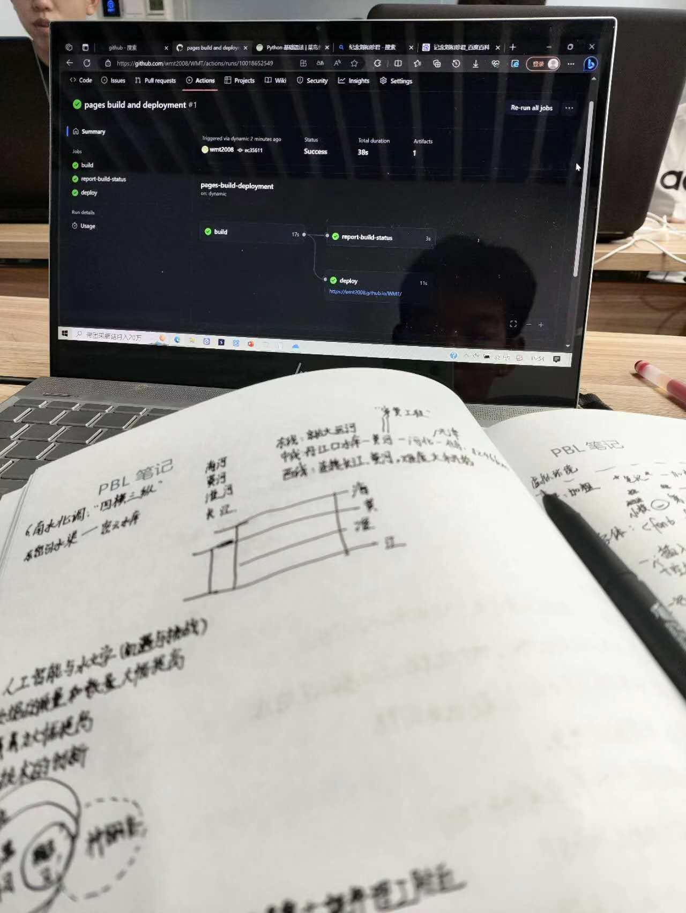
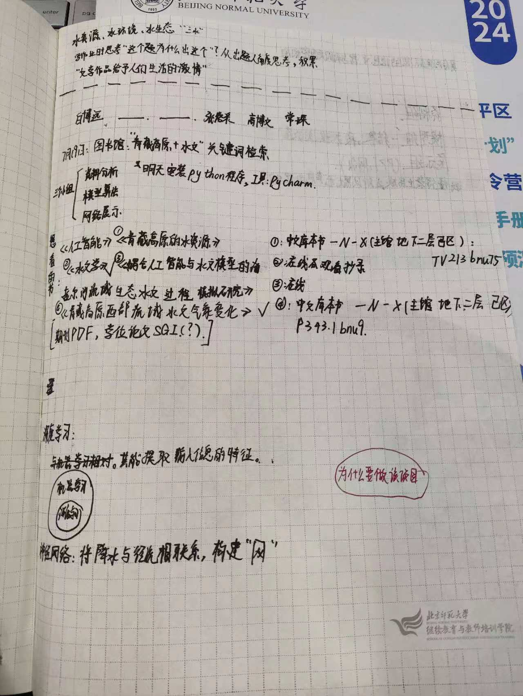
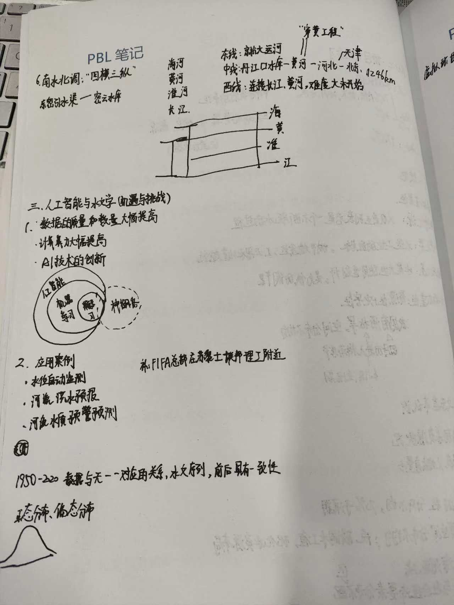

  
### ___这是第二级标题___

**为什么要进行青藏高原的径流预测？**

- 青藏高原是全球最重要和最脆弱（水源涵养力，气候变暖导致水源不稳定）的几个水塔的聚集区。作为世界上最大的高原，青藏高原的隆升显著改变了北半球的大气环流，导致了亚洲季风强化以及亚洲内陆干旱化，其陆-海-气相互作用对全球自然和气候环境产生深远影响。

**为什么利用ai进行径流预测？**

- 人工智能与水文学的结合具有很多好处，例如水位自动监测、河流洪水预报和河流水质预警预测。由于青藏高原地区海拔高、落差大、冰川、积雪广泛分布，使得实地考察数据缺失成为制约在青藏高原区域开展水文过程研究和深入理解由冰雪补给的流域水资源对气候变化响应机制的一个主要因素，因此针对此区域基于多源数据开展径流预测研究具有重要意义。Ai可以通过神经网络的搭建帮助径流的预测，通过技术节省人力和时间。
 
**如何利用ai进行径流预测？**

- 暂时空缺。

  

2. The second letter of ONE is N .

3. The third letter of ONE is E .

##这是我的模型
